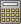

# Isocoulombic Reactions Generator
* [How to use the isocoulombic reactions generator](#How.to.generate.isocoulombic.reactions)
* [Application Menu](#Application.Menu)

Given a list of selected non isocoulombic reactions and a list of selected model reactions, the isocoulombic reactions generator will generate all possible isocoulombic reactions, by combining the non isocoulombic reactions with the model reactions. The logK values for the non isocoulombic reactions can be then calculated by using the isocoulombic reactions using one-, two- or three-term extrapolation methods. 

  
_Empty Isocoulombic Reactions Generator Window_

## How to generate isocoulombic reactions
> __Note__  
Follow the messages written in the status bar for the work flow, success, and error messages. 

__1.__ To start using the Isocoulombic Reactions Generator Application first click the [Select Database source and Elements](#Source.Database.Elements) . Chose the desired source database (_Step 1_), in the next step the desired elements (_Step 2_), and in the last step if present the desired reaction sets (_Step 3_). This will filter the data available for generating reactions.  

> __Note__  
The available elements are based on the available substances in the selected source database. If a substance contains an element, the element will be selectable.  

|   |   |  |
|::|::|::|
| _Step 1_ | _Step 2_  | _Step 3_  |

__2.__ Select one or more non-isocoulombic reactions to be investigated, by clicking [Select Investigated Reactions](#) .

  
_Select Investigated reaction/s_

__3.__ Select the model reactions which will be used for generating isocoulombic reactions, by clicking [Select Model Reaction](#) . 

  
_Select Model Reactions_

__4.__ Generate isocoulombic reactions, by clicking [Generate Isocoulombic Reaction](#) . If the reactions were successfully generated, they will be displayed in the window, together with their properties at 25 C 1 bar. 

You can now calculate the logK values for the investigated reactions (or the isocoulombic reactions) using the one-, two-, and three-term extrapolation methods. Or you can now save a selection from the generated isocoulombic reactions as reaction sets. 

  
_Successfully generated isocoulombic reactions_

__5.__ Calculated logK values for the investigated reactions at different temperature and pressure points, by clicking [Calculate Properties of Invesitgated Reactions](#) . If calculation was successful, view and plot the result by clicking [Show and Plot Results](#) . 

> __Note__  
The result are written in a result_.csv file found in the application folder. 

__5b.__ Calculated logK values for the generated isocoulombic reactions at different temperature and pressure points, by clicking Tools/[Calculate Properties of Generated Isocoulombic Reactions](#) . If calculation was successful, view and plot the result by clicking [Show and Plot Results](#) .

__6.__ Save a selection from the generated isocoulombic reactions, by clicking [Save Reactions Set](#) . 

## Application Menu 
* __File__
  *  __New/Reset__: Resets the Isocoulombic Reactions Generator window. 
  *  __Save Reaction Set__: Save generated isocoulombic reactions in the database as a Reactions Set, for each isocoulombic reaction. Set the Reaction Set __Symbol__, __Comment__ and __Reaction Level__ in the respective fields. 
> __Note__  
The symbol of the saved reaction set will be the value entered in the __Symbol__ field _ the symbol of the isocoulombic reaction    
* __Data__
  *  __Select Data Source and Elements__: Opens a wizard for selecting the source database and elements for filtering the data to be used for generating reactions. Select the source database from the available list of source databases. Next, select the elements which the substances and reactions should contain. 
  *  __Select Investigated Reactions__: Select one or more reactions which are not isocoulombic, but which will be combined into isocoulombic reactions. 
  *  __Select Model Reactions__: Select the model reactions, which will be used to generate isocoulombic reactions, by combining them with the selected investigated reactions. 
* __Tools__
  *  __Generate Isocoulombic Reactions__: Generate isocoulombic reactions form the selecte reactions to ivestigate and model reactions.
  *  __Calculate Properties of Reactions to Investigate at TP__: Calculates the logK values of the reactions to investigate at different temperature and pressure points, using the properties of the generated isocoulombic reactions and the one-, two-, or three-term extrapolation method. 
  *  __Calculate Properties of Generated Isocoulombic Reactions at TP__: Calculates the logK values of the generated isocoulombic reactions at different temperature and pressure points, using the one-, two-, or three-term extrapolation method. 
* __Results__
  *  __Show table with Results__: Opens the output CSV (Comma Separated Value) file with result and automatically plots the logK values against temperature. 
* __Preferences__
  * __Set extrapolation methods individually__: If set, the user will be asked to choose the extrapolation method for each generated isocoulombic reaction when calculating logK values or when saving the reactions. 